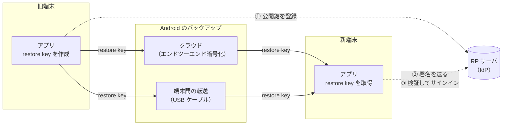
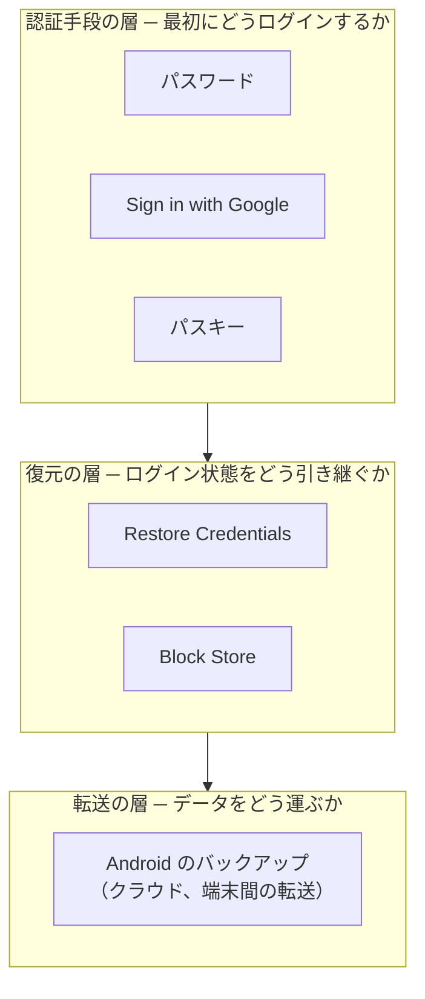

<!--
プロダクト編。構成メモ: ~/Downloads/restore-credentials-product-outline.md
一次情報の控え（2026-09-27 取得）: scratchpad/src/*.txt
- 事実 = Google の公式記載（出典を脚注に付ける）。意見 = 筆者の見解（コールアウトに入れ、主語を明示する）
- 筆者の手元での確認結果は「筆者の見解」のコールアウトの中で「筆者が試した範囲では」と書き分けた（ラベルの扱いは要判断）
- 旧構成（restore-credentials-idp-design.md の Q&A）のうち IdP の深い論点は技術編の素材として残す
TODO:
- [ ] 図: TL;DR の対比キャプチャ、3.1 のデモ GIF（自作サンプルか公式サンプルで撮る）
- [ ] 技術編のリンクを公開後の URL に差し替える
- [ ] 公開前に Play のヘルプページの追加発表を再確認する（例外の詳細は「今後数か月以内」）
- [ ] FiPA のステータスを公開時点で再確認する
- [ ] GMS の最小バージョンの表記（ドキュメントは 24220000）を公開時点で再確認する
-->

:::message
**執筆日**: 2026 年 9 月 27 日　**最終更新日**: 2026 年 9 月 27 日
本記事は執筆時点の公式情報にもとづきます。要件と例外の詳細は、今後 Google から追加で公開される予定です。参照する際は、末尾の参考資料で最新の情報を確認してください。
:::

## TL;DR

- 2027 年 4 月から、ログイン機能のある Android アプリは Google Play の要件として「Zero-Tap Sign-In restoration」への対応が必須になります[^play][^blog26]。
- 機種変更時の手動ログインが、ユーザの離脱とフィッシングなどのセキュリティリスクを生んでいることが理由です[^play]。
- 対応の主な手段は Restore Credentials で、機種変更時にアプリのデータを復元すると、初回起動時にはログイン済みの状態になる仕組みです[^play][^about]。
- 導入には Android アプリ側と IdP（サーバ）側の両方の改修が必要で、サーバ側はパスキーと共通の実装を使えます[^impl]。
- 要件を満たすには新しい端末で「ユーザが誰か」が復元されれば足り、MFA などの追加認証を求めるかはアプリ側で判断できます[^play]。
- ゲームや規制業種の一部には対象外・例外の扱いがあり、詳細は今後 Google から追加で公開される予定です[^play]。

<!-- TODO: 図 — 旧来の体験（機種変更後にログイン画面が出る）と新しい体験（ログイン済みで起動する）の対比キャプチャ（静止画 1 枚） -->

## この記事について

こんにちは、[task（@task4233）](https://x.com/task4233)です。機種変更をした直後、アプリを開くたびにログインし直した経験はないでしょうか。2027 年 4 月から、Google Play はこの手間をなくすことを、ログイン機能のあるアプリに求めるようになります。

本記事は、この要件と、要件を満たす主な手段である Restore Credentials について、導入を検討するときに生じる疑問に答えるものです。「Zero-Tap Sign-In restoration」という言葉を聞いたことはあるものの、何を求められているのか、自分のアプリに関係があるのかが分からないという方にも読んでいただけるように書きました。想定している読者と、読むとよい章は次のとおりです。

| 読者 | 読むとよい章 | 読み終えたときにできること |
|---|---|---|
| PM | 1〜3 章、7 章、8 章 | 対象か、期限はいつか、例外を申請すべきか、どこまで対応するかを判断し、関係者に相談できる |
| IdP の実装・運用者 | 4 章、5 章、7 章 | restore key のライフサイクルと、既存の認証基盤との関係を把握できる |
| Android の実装者 | 3 章、4 章、6 章 | 実装とテストの全体像を把握し、公式ドキュメントのどこから読めばよいかが分かる |

本記事で扱うのは、Google Play の要件と Android の Restore Credentials だけです。iOS は扱いません。実装とサーバ側の設計の詳細は、技術編で扱います。

本記事は筆者個人の見解であり、特定の企業やアプリとは関係しません。Google の公式の記載は出典を付けて事実として書き、筆者の解釈は「筆者の見解」の枠に入れて区別します。

<!-- TODO: 技術編のリンクカード（公開後に差し替え） -->

## 1. なぜ今なのか

### 1.1 Google Play の技術品質要件として発表された

Google は 2026 年 8 月 26 日、Google Play で公開するアプリに向けた新しい技術品質要件を発表しました[^blog26]。そのうちの 1 つが、機種変更後のログインに関する要件である Zero-Tap Sign-In restoration です。

Play Console のヘルプには、2027 年 4 月から、ユーザのサインインに対応するアプリ（サインインが任意か必須かを問わない）は、ユーザが以前の Android 端末から新しい端末に移り、端末間の転送かクラウドバックアップからデータを復元したときに、Zero-Tap Sign-In restoration に対応しなければならないと明記されています[^play]。

この要件を満たす主な手段として名前が挙がっているのが、Android の Credential Manager の機能である Restore Credentials です[^play]。About Restore Credentials によると、Restore Credentials は、新しい端末をセットアップしたあとにアプリを初めて開いたとき、ユーザのアカウントを自動で復元してサインイン済みにする機能です[^about]。

### 1.2 なぜ要件になったのか

Play Console のヘルプは、要件の理由として、端末のセットアップ中の手動サインインが次の 2 つの問題を招くことを挙げています[^play]。

1. オンボーディングの摩擦になり、ユーザの定着率を下げるため
2. セットアップ中のアプリを、フィッシングや認証情報の窃取といったセキュリティリスクにさらすため

Android Developers Blog では、Restore Credentials を導入した事例として Uber が紹介されています[^uber]。Uber は試験運用で、手動ログイン（SMS のワンタイムパスワード、パスワード、ソーシャルログイン）が 3.4% 減ったと報告しています。さらに、試験運用の結果から、導入を広げれば手動ログインを年間 400 万件なくせると見積もっています。

### 1.3 スケジュール

要件に関係する日付と、それぞれがあなたのアプリにとって何を意味するかは、次のとおりです。

| 日付 | 出来事 | あなたのアプリにとっての意味 |
|---|---|---|
| 2024 年 11 月 20 日 | Restore Credentials が Credential Manager のライブラリ（androidx.credentials 1.5.0-beta01 以降）で使えるようになった[^blog24] | 要件のための新しい API を待つ必要はなく、今から導入できる |
| 2026 年 8 月 26 日 | Zero-Tap Sign-In restoration の要件が発表された[^blog26] | ここから施行まで、およそ 8 か月 |
| 2026 年 9 月 30 日 | Block Store の経過措置の締切[^play] | この日までに Block Store を使った仕組みが本番で動いていたアプリにだけ関係する |
| 2027 年 4 月 | 要件の施行[^play] | 対象のアプリは、この時点で対応している必要がある |

Block Store の経過措置は、締切の時点ですでに Block Store を使った仕組みが本番で動いているアプリにだけ関係します（2.2 節）。これから Block Store で対応しようとしても間に合わないので、新たに対応するアプリは Restore Credentials を前提にしてください。また、3.2 節で述べるとおり、restore key は旧端末で作られている必要があるので、施行日の直前ではなく、早めにリリースするほど効果が出ます。

### 1.4 対応しないと何が起きるか

Play Console のヘルプには、このページの要件はどれも任意ではなく、満たさない場合は Google Play でのアプリの露出（visibility）と公開の機能（publishing capabilities）に影響しうると書かれています[^play]。発表ブログも、2027 年 4 月以降、公開の機能を完全に保ち、Play ストアで最適な露出を得るには、この要件を満たす必要があると述べています[^blog26]。

また、Play Console のヘルプには、要件を満たしていないと判断されたアプリには通知が届くと書かれています[^play]。具体的にどのような措置が取られるのか、猶予があるのかは、執筆時点では書かれていません。

## 2. あなたのアプリは対象か・何をすれば対応したことになるか

### 2.1 対象となるアプリ

Play Console のヘルプによると、対象になるのは次の条件を満たすアプリです[^play]。

- ユーザのサインインに対応している（サインインが任意か必須かを問わない）
- モバイルかタブレット向けである（ほかのフォームファクタは対象外）

Play Console のヘルプには、Restore Credentials は Android 9 以上で利用できると書かれています[^play]。ユーザアカウントやログイン機能のないアプリは、影響を受けないと明記されています[^play]。

### 2.2 対象外と例外

Play Console のヘルプは、対象外と例外として次の 4 つを挙げています[^play]。

1. **ゲーム**: 現時点では対象外です。複雑な認証を扱うゲーム向けのガイダンスは、2027 年に示される予定です。単一のアカウントで遊ぶゲームには、Restore Credentials の導入が強く推奨されています。ゲームかどうかは、Play Console のストアの設定で選ぶカテゴリで決まります[^play]。同じページの FAQ（メモリの要件の項）には、異なる技術的なしきい値を適用してもらう目的で、アプリの実態と異なるカテゴリに変えることは、ストアの掲載情報に関するポリシーの違反にあたると書かれています[^play]。要件を避けるためにカテゴリを変えることは避けてください。
2. **完全に非公開のアプリと、企業の端末管理アプリ**: 要件の範囲外です。
3. **規制業種**: 金融やヘルスケアのように、厳しい規制やコンプライアンスの要請がサインイン機能に影響するアプリは、例外の対象になる「場合がある（may be eligible）」と書かれています。例外を受けるには、施行日より前に Play Console から申請する必要があります。
4. **Block Store の経過措置**: 2026 年 9 月 30 日までに Block Store を使った仕組みが完成して本番で動いており、ユーザのサインイン状態を正常に復元できている場合に限り、準拠とみなされる可能性があります。ほかの方式や、締切より後に完成したものは準拠とみなされません。

Play Console のヘルプには、要件と例外の詳細は今後数か月のうちに公開すると書かれています[^play]。自分のアプリが例外にあたるかの案内も、後日示すと書かれています[^play]。例外を検討しているアプリは、公開前の最新情報を確認してください。

### 2.3 何をすれば準拠になるか

要件を満たすには、新しい端末で「ユーザが誰か」が復元されれば足ります。Play Console のヘルプには、ユーザの識別情報を復元すること（たとえば「おかえりなさい、Alex さん」と表示すること）で要件を満たせると書かれています[^play]。つまり、新しい端末で追加の本人確認を求めること自体は、要件と矛盾しません。

対象になるのは、旧端末でサインインしていたユーザです[^play]。次の 2 つのユーザについて、Play Console のヘルプは、新しい端末でも同じ状態で起動すればよいとしています。

- 旧端末でサインアウトしていたユーザ: 新しい端末でも、サインインしていない状態で起動します。
- ゲストとして使っていたユーザ: 新しい端末でも、ゲストモードで起動します。

1 つのアプリで複数のアカウントを切り替えて使っている場合は、旧端末で現在アクティブなアカウント（または最後にアクティブだったアカウント）を復元の対象にします[^play]。

## 3. 何ができるようになるのか

### 3.1 デモ：機種変更後の体験

<!-- TODO: 図 — デモ GIF（新しい端末でアプリを初めて開くと、ログイン画面を経ずにホーム画面が表示される） -->

新しい端末のセットアップでアプリのデータを復元すると、アプリを初めて開いた時点でサインイン済みになります。About Restore Credentials と実装ガイドには、この処理は端末のセットアップ中にバックグラウンドで静かに行われ、ユーザは追加の入力なしにサインインできると書かれています[^about][^impl]。

### 3.2 誰に・どんなときに効くか

ただし、すべてのユーザの再ログインがなくなるわけではありません。Restore Credentials が効くのは、次の条件がそろったときです。

- **旧端末で、対応版のアプリが restore key を作っている**: restore key は、ログインを復元するための鍵です（4 章で詳しく説明します）。旧端末でアプリを開き、サインインした状態で作られます[^about]。
- **ユーザが端末のセットアップ時にデータを復元する**: クラウドバックアップからの復元か、旧端末と新端末を USB ケーブルでつなぐ端末間の転送（D2D）のどちらかです[^about]。
- **クラウドバックアップの場合は、旧端末で次の 3 つの条件を満たしている**: Google アカウントにサインインしている、Android のデータバックアップが有効になっている、画面ロック（パターン、PIN、パスワード、生体認証）を設定している[^about]。
- **旧端末でサインインしていた**: サインアウト済みのユーザやゲストは、もともと復元の対象外です（2.3 節）。

公式ドキュメントには、これ以外にも次の 3 つの制約が書かれています。

1. 同じ端末でアプリをアンインストールして再インストールしても、restore key は戻りません。アンインストールした時点で restore key は削除されます[^play]。
2. 仕事用と個人用のように複数のシステムプロファイルがある端末では、restore key を使えるのは最初にセットアップしたプロファイルだけです[^about]。
3. 1 つのアプリで復元できるアカウントは 1 つだけです[^about]。

:::message
**筆者の見解**
筆者は、効果を大きく左右するのはリリースの時期だと考えます。restore key は旧端末で作られている必要があるので、対応版のアプリが旧端末に入っていなければ、その後に機種変更しても効きません。2027 年 4 月の施行日に合わせてリリースするのではなく、早めにリリースしておくほど、その後の機種変更で恩恵を受けるユーザが増えます。

また、Restore Credentials の動作条件には Google Play 開発者サービス（GMS）のバージョンが含まれているので[^impl]、Google Play 開発者サービスが搭載されていない端末では使えないと考えられます。
:::

<!-- TODO: 図 — 効く条件を示す図（旧端末の条件 → 移行の方法 → 新端末の条件） -->

### 3.3 最低限の対応とフル活用の違い

Restore Credentials の使い方には、最低限の対応とフル活用の 2 段階があります。

最低限の対応は、新しい端末でユーザが誰かを識別できる状態にすることです。2.3 節のとおり、これで要件は満たせます[^play]。そのうえで、支払いのような重要な操作の前に追加の本人確認を求めるかは、アプリが決めます[^play]。

フル活用は、追加の本人確認なしにセッションまで復元し、ユーザがアプリを開く前から使える状態にすることです。Android のバックアップの仕組みでアプリのデータを復元している場合、`BackupAgent` の `onRestoreFinished` の中で restore key を取得するよう推奨されています[^impl]。実装ガイドと Play Console のヘルプは、こうするとユーザがアプリを開く前にサインインを済ませられるので、パーソナライズした通知を送れると説明しています[^impl][^play]。

なお、`onRestore` は key-value 形式のバックアップでしか呼ばれないので使わないように、と明記されています[^impl]。

また、通知は restore key の取得で自動的に戻るわけではありません。実装ガイドには、Firebase Cloud Messaging（FCM）を使っている場合は、FCM のトークンを取得し直してバックエンドに送る必要があると書かれています[^impl]。

## 4. どのような技術か

### 4.1 全体像

Restore Credentials の全体像は次のとおりです。

旧端末のアプリは、ユーザがサインインしたあとに restore key を作り、その公開鍵を RP サーバに登録します（①）。restore key は Android のバックアップの仕組みで新端末に運ばれます。新端末のアプリは、初めて起動したときに restore key を取り出し、それで作った署名を RP サーバに送ります（②）。RP サーバは、登録済みの公開鍵で署名を検証してユーザを特定し、サインインさせます（③）[^about][^impl]。

### 4.2 図に出てくる用語

図に出てきた用語を、次の 3 つにまとめます。

- **restore key**: ログインを復元するための資格情報です。公式ドキュメントでは restore credential とも呼ばれています[^about]。ローカルに保存したり、クラウドにバックアップしたりでき、新しい端末でのアクセスの提供に使われます[^about]。
- **Credential Manager**: パスキーやパスワードなどの資格情報を扱う Android の API・ライブラリの総称です。Restore Credentials はその機能の 1 つです[^about]。
- **RP サーバ**: 公式ドキュメントの「relying party server」を指します。本記事では、ユーザを認証する IdP のサーバのことです。

### 4.3 restore key のライフサイクル

restore key のライフサイクルは、作成、移行、取得、削除の 4 段階に分けられます。

**作成**: 旧端末で、ユーザがサインインした直後に作ります。すでにサインインしていて restore key がまだない場合は、アプリの起動時にも作ります[^impl]。作成はユーザの操作なしに行われます[^about]。

**移行**: restore key は、Android のバックアップの仕組みで新しい端末に運ばれます[^about]。アプリの開発者が、端末間の受け渡しを実装する必要はありません。

**取得**: 新しい端末でアプリを初めて起動したときに取得します。前節の `onRestoreFinished` で、アプリのデータの復元直後に取得することもできます[^impl]。

**削除**: restore key は使ったあとも自動では削除されません[^impl]。削除されるのは次の 2 つの場合だけです[^impl]。

- ユーザがアプリをアンインストールするか、アプリのデータを消去したとき
- アプリが `clearCredentialState()` を呼んだとき

そのため、ユーザがサインアウトしたときや退会したときには、アプリが自分で restore key を削除する必要があります[^impl][^play]。Web でパスワードを変更したときのように、サーバ側でセッションが無効になった場合も同様です[^impl]。

また、restore key はアプリのパッケージ名に紐づきます[^impl]。同じ IdP で複数のアプリを運営していて、それぞれのパッケージ名が異なる場合は、アプリごとに restore key を作る必要があります。

### 4.4 誰が何を改修するのか

Restore Credentials の導入には、Android アプリと IdP の両方の改修が必要です。役割の分担は次のとおりです。

| 担当 | 主な改修 |
|---|---|
| Android アプリ | サインイン後と起動時の restore key の作成、新しい端末での取得とサーバへの送信、サインアウト時の削除、例外への対応 |
| IdP | restore key の登録と検証（パスキーと共通の実装）、パスキーとの区別、restore key を使ったサインイン後のセッションの扱い |

公式には、実装を支援する AI エージェント向けの skill も公開されています[^skill]。実装とサーバ側の設計の詳細は、技術編で扱います。

## 5. 既存技術との関係

### 5.1 Restore Credentials の位置づけ

「パスキーに対応していれば足りるのでは」「Block Store と何が違うのか」という疑問は、技術ごとに解決している課題の層が異なることを押さえると整理できます。

パスワード、Sign in with Google、パスキーは、最初にどうログインするかの手段です。Restore Credentials と Block Store は、ログインした状態を新しい端末にどう引き継ぐかの手段です。Block Store は、Google Play 開発者サービスが提供する、再認証のためのデータ（トークンなど）を保存して新しい端末で取り出せる API です[^blockstore]。どちらも、データは Android のバックアップの仕組みで運ばれます。

### 5.2 既存の仕組みだけで要件を満たせるか

第一に、パスキーや Sign in with Google に対応しているだけでは、要件は満たせません。これらは最初のログインを楽にする手段であり、新しい端末でログイン状態を引き継ぐこととは別の話です。実装ガイドには、Restore Credentials はアプリの認証方法（パスワード、Sign in with Google など）とは独立して動くと書かれています[^impl]。

第二に、Block Store で満たせるのは、2.2 節の経過措置の条件を満たす場合だけです[^play]。Block Store のドキュメントにも、Credential Manager のパスキーの利用を検討するよう書かれています[^blockstore]。

第三に、Android の自動バックアップ（Auto Backup）でトークンをそのまま新しい端末に移す方法は、要件の中で準拠と明記された方法ではありません。Play Console のヘルプには、要件の準拠は restore key の取得に成功したかどうかで判定すると書かれています[^play]。Uber の事例でも、通常のデータバックアップや Block Store でトークンを直接受け渡す方法は、トークンが機密性の高い情報であるために限られた用途でしか使われていなかったと紹介されています[^uber]。

公式ドキュメントは、ログイン状態は Restore Credentials で、設定や下書きなどのアプリの状態は自動バックアップで引き継ぐという組み合わせを勧めています[^about]。なお、実装ガイドには、Restore Credentials はマニフェストの `allowBackup` の設定にかかわらず動作すると明記されています[^impl]。

:::message
**筆者の見解**
自動バックアップを有効にしているアプリは、バックアップの対象にトークンやセッションの情報が含まれていないかを確認することをおすすめします。筆者が試した範囲では、`allowBackup="true"` のアプリでトークンを保存したファイルがバックアップに含まれ、新しい端末に移りました。この場合、restore key を使わなくてもログイン済みの状態になるため、Restore Credentials が効いているのかを区別できなくなります。詳しい確認方法は技術編で扱います。
:::

### 5.3 パスキーとの関係

IdP 側の工数をもっとも左右するのは、すでにパスキーに対応しているかどうかです。公式ドキュメントには、パスキーを処理するサーバがあるなら、restore key にも同じサーバ側の実装を使うように書かれています[^impl]。About Restore Credentials は、サーバ側の実装が共通であることを理由に、すでにパスキーに対応しているアプリに Restore Credentials を特に推奨しています[^about]。一方で、アプリ側はパスキーに対応していなくても restore key を使えます[^impl]。

したがって、IdP の状況によって必要な作業は次の 2 つに分かれます。

- **パスキー対応済みの IdP**: 既存の WebAuthn の登録・検証の仕組みを流用できるので、追加の工数は比較的小さくなります。
- **パスキー未対応の IdP**: WebAuthn の登録と検証の仕組みを新たに用意する必要があります。

ただし、「共通の実装を使える」ことは「パスキーとまったく同じに扱ってよい」ことを意味しません。公式ドキュメントには、restore key とパスキーはサーバのデータベースで区別して保存するよう書かれています[^impl]。Uber の事例でも、既存の WebAuthn の仕組みが「ユーザの確認（生体認証など）が常に行われる」「すべての資格情報がアカウント設定に一覧表示される」ことを前提にしていたため、新しい資格情報の種別を作って区別したと紹介されています[^uber]。どこをどう区別すべきかは、技術編で扱います。

## 6. 今試せるものはあるか

### 6.1 必要な環境

Restore Credentials が動く環境は次のとおりです[^impl]。

| 項目 | 条件 |
|---|---|
| Android | 9（API レベル 28）以上 |
| Google Play 開発者サービス（GMS） | コアのバージョン 24220000 以上 |
| androidx.credentials | 1.5.0 以上（実装ガイドのサンプルは 1.7.0-alpha03） |

### 6.2 手元で体験を再現する手順

公式のテスト手順では、Android Studio のバックアップと復元の機能を使います[^test]。前提として、Android Studio Otter（2025.2.1）以上と、デバッグ可能なビルドのアプリが必要です[^test]。手順は次の 4 つです[^test]。

1. アプリを起動してサインインし、Running Devices ウィンドウ上部のデバイスオプションにある「Backup App Data」を押します。バックアップの種類は「Device to Device」か「Cloud」を選びます。
2. 同じ端末で試す場合は、アプリをアンインストールしてから再インストールします。別の端末で試す場合は、その端末にアプリをインストールします。
3. 同じくデバイスオプションの「Restore App Data」を押して、先ほど作ったバックアップを選びます。
4. アプリを開き直すと、restore key でサインインした状態になります。

テスト手順には、クラウドのバックアップで試す場合は、マニフェストの `android:allowBackup` を `true` にしておく必要があると書かれています[^test]。

:::message
**筆者の見解**
公式のテスト手順が前提にしているのはエミュレータですが、筆者が試した範囲では実機でも同じ手順で確認できました。

一方で、この手順で確かめられるのは「restore key が新しい端末にあればサインインできるか」までです。実際の機種変更の流れ（端末のセットアップ中に Play ストアからアプリが入り、データが復元される流れ）まで確かめるには、Play ストアで配信したアプリで試す必要があると考えます。筆者が手元でインストールしたアプリで 2 台の端末間の転送を試したところ、アプリ自体が移らず、restore key も新しい端末に届きませんでした。検証の進め方は技術編で扱います。
:::

## 7. 現状の疑問点

ここからは、導入を検討するときに出てくる疑問のうち、執筆時点で答えが定まっていないものを整理します。各疑問には、次の 2 つのラベルのどちらかを付けました。

- **公式の回答あり**: Google の公式の記載で答えられるもの（一部だけ答えられるものを含む）
- **公式の記載なし（筆者の見解）**: 公式の記載が見つからず、筆者の見解で補っているもの

本記事では「何を決める必要があるか」までを示し、決め方の詳細は技術編に送ります。

### 7.1 対象範囲と準拠

| 疑問 | ラベル | 公式の記載 | 筆者の見解 |
|---|---|---|---|
| 特定のユーザを意図的に除外してよいか | 公式の記載なし（筆者の見解） | 対象は旧端末でサインインしていたユーザ[^play]。アカウントの種別や地域などで意図的に絞り込めるかは記載がない | 除外の条件が準拠の判定にどう影響するかは不明です。除外したい場合は、例外の申請を含めて Google の追加の案内を待つのが安全だと考えます |
| 準拠していることを自分でどう確認するか | 公式の回答あり（一部） | 準拠は restore key の取得に成功したかどうかで判定され、満たしていないと判断されたアプリには通知が届く[^play]。成功率の閾値は記載がない | Play 側の判定の中身は分からないので、restore key の作成と取得の成否をアプリ側でも計測しておくべきだと考えます（7.5 節） |
| 例外申請の基準と手続き | 公式の回答あり（今後公開予定） | 例外の案内は後日示される。規制業種は施行日より前に Play Console から申請する[^play] | 申請の要否を判断するための材料（自社の規制上の制約、サインイン機能への影響）は、案内を待たずに整理しておけます |

### 7.2 認証強度とセキュリティ

| 疑問 | ラベル | 公式の記載 | 筆者の見解 |
|---|---|---|---|
| 復元されたセッションにどの認証強度を与えるか | 公式の回答あり（一部） | Restore Credentials は MFA を扱わず、アプリのセキュリティポリシーを迂回するためのものでもない。追加の本人確認を求めるかはアプリが決める。一方で、端末間の転送による復元は所持の強い証明になるので、追加の MFA は求めるべきではないと書かれている[^play] | 下のコールアウトを参照 |
| restore key によるサインインをどこまで信頼してよいか | 公式の回答あり（一部） | Restore Credentials は認証（ユーザの識別とセッションの復元）専用で、OAuth の権限の付与や MFA は扱わない。必要な場面で、その場で権限を求めたり、追加の本人確認を求めたりする 2 段階の進め方が推奨されている[^play] | 「ログインの復元」と「重要な操作の許可」を分けて設計するのが、公式の推奨にも沿った進め方だと考えます |
| 残るリスクは何か | 公式の記載なし（筆者の見解） | — | restore key の安全性は、Android のバックアップの経路（Google アカウントと端末の保護）に依存します。Google アカウントが乗っ取られた場合の影響は、技術編で扱います |

:::message
**筆者の見解**
restore key の取得はユーザの操作なしで行われるため、筆者は、restore key によるサインインをそれ単体で多要素認証とみなすのは難しいと考えます（公式の記載ではありません）。たとえば NIST SP 800-63B Rev.4 は、AAL2 に 2 つの異なる認証要素の所持と制御の証明を求めており、ユーザの確認（UV）のない認証器は単一要素の暗号認証器として扱うとしています[^nist]。また、セッションは、それを確立した認証より高い保証レベル（AAL）とみなしてはならないとしています[^nist]。

Google の「端末間の転送は所持の強い証明になる」という記載とどう折り合いを付けるかは、サービスのリスクの許容度によって変わります。詳細は技術編で扱います。
:::

### 7.3 鍵とセッションの運用

| 疑問 | ラベル | 公式の記載 | 筆者の見解 |
|---|---|---|---|
| 不審なログインや乗っ取りに気づいたとき、どう止めるか | 公式の記載なし（筆者の見解） | 端末側の restore key を削除する方法（サインアウト時、サーバ側でセッションが無効になったとき）は記載がある[^impl]。サーバ側で止める方法は記載がない | 端末側の削除は、削除の処理を実行した端末の restore key にしか効きません。乗っ取った側がすでに別の端末に restore key を持っている場合、利用者の端末で削除しても、その鍵は消えません。一方、restore key によるサインインは必ずサーバでの署名の検証を経るので、サーバ側で公開鍵を無効にすれば、鍵がどの端末に残っていても検証で弾けます。サーバ側で公開鍵を無効にする手順を、乗っ取り対応の手順に組み込む必要があると考えます |
| サーバ側の使われなくなった鍵をどう失効させるか | 公式の回答あり（一部） | 端末側はアンインストールで削除される[^impl]。サーバ側の手順は公式ドキュメントにはないが、Uber の事例では、アンインストールがサーバに通知されず使われない鍵が残ること、鍵に十分な有効期間を持たせる必要があること、1 人のユーザに端末ごとの鍵を持たせる必要があることが課題として紹介され、新しい鍵の登録と鍵の利用にもとづく削除のルールで対処したと紹介されている[^uber] | 有効期間と削除のルールは、サインアウトや機種変更の流れと合わせて決める必要があります |
| ユーザのパスキー管理画面に restore key をどう見せるか | 公式の回答あり | restore key はシステムが管理するものなので、パスキーの管理画面からは隠すよう書かれている。そのために、サーバのデータベースでパスキーと区別して保存する[^impl] | 隠すと、ユーザが restore key の存在に気づけなくなります。ユーザが自分で止めたいとき（端末の紛失時など）の手段を別に用意するかは、プロダクトとして決める必要があります |
| 復元後、旧端末のセッションはどうするか | 公式の記載なし（筆者の見解） | — | 同時にログインできる端末の数を制限しているサービスでは、新しい端末でのサインインが旧端末のセッションとどう数えられるかを決める必要があります |

### 7.4 Web・ブラウザとの連携

| 疑問 | ラベル | 公式の記載 | 筆者の見解 |
|---|---|---|---|
| 既存の OAuth/OIDC の基盤とどう接続するか | 公式の記載なし（筆者の見解） | — | ブラウザで認可コードを受け取る形の基盤では、restore key によるサインインの結果をトークンの発行につなぐ経路を新たに設計する必要があります。その選択肢の 1 つとして、IETF で議論されている OAuth 2.0 for First-Party Applications（FiPA）があります[^fipa]。FiPA との関係は表の下で補足します |
| アプリはログイン済みなのに、アプリ内で Web ページを開くと再ログインを求められないか | 公式の記載なし（筆者の見解） | — | restore key で復元されるのはアプリのセッションです。アプリ内で開くブラウザのセッションまで自動でつながるわけではないので、体験のずれが生じないかを確認する必要があります。仕組みの違いは技術編で扱います |

:::message
**筆者の見解**
FiPA は、Restore Credentials の代わりにはならないと筆者は考えます。両者は担う層が異なるためです。Restore Credentials は、旧端末で作った restore key をユーザの操作なしで新しい端末に運び、そこで署名させるための Android の API です。一方の FiPA は、ファーストパーティのアプリがブラウザを介さずに認可サーバからトークンを受け取るための OAuth のプロトコルで、Authorization Challenge Endpoint に認証の材料（署名したパスキーの challenge など）を送って認可コードを得る流れを定めています[^fipa]。FiPA 自体は、新しい端末で「ユーザが誰か」を示す材料を運ぶ仕組みを持っていません。

また、Play Console のヘルプには要件の準拠は restore key の取得に成功したかどうかで判定すると書かれているので[^play]、restore key を使わずに FiPA だけで組んだ仕組みは、準拠の判定の対象にならないと考えられます。

したがって、Restore Credentials で restore key を取り出し、その署名を FiPA の Authorization Challenge Endpoint に送ってトークンを得る、という組み合わせ方になります。つまり、使う API は Restore Credentials に限られ、FiPA は restore key によるサインインを既存の OAuth/OIDC の基盤につなぐ方法の 1 つという関係です。独自のエンドポイントでトークンを発行する方法や、既存の WebAuthn の検証の結果をトークンに換える方法も、同じ位置づけの選択肢です。FiPA は執筆時点ではインターネットドラフトなので、採用する場合は仕様が変わる可能性を織り込む必要があります。
:::

### 7.5 プロダクト・ビジネス上の判断

| 疑問 | ラベル | 公式の記載 | 筆者の見解 |
|---|---|---|---|
| ユーザへの説明とプライバシーポリシーの見直しは必要か | 公式の記載なし（筆者の見解） | — | restore key の作成と移行はユーザに見えないところで行われます。ユーザへの説明やプライバシーポリシーへの記載が必要かは、法務と確認することをおすすめします |
| 効果をどう測るか | 公式の記載なし（筆者の見解） | 公式の指標はない。Uber の事例では、手動ログインの減少率、SMS のワンタイムパスワードの費用、ホーム画面に到達した端末の割合などが示されている[^uber] | restore key の作成と取得の成功率、restore key が見つからなかった割合、機種変更後の手動ログインと離脱の割合を、導入前から計測しておくと比較しやすいと考えます |

## 8. まとめと次のアクション

### 8.1 まとめ

2027 年 4 月から、ログイン機能のある Android アプリは、機種変更後にユーザを再ログインさせない「Zero-Tap Sign-In restoration」への対応を Google Play から求められます。対応の主な手段は Restore Credentials で、旧端末で作った restore key を Android のバックアップの仕組みで新しい端末に運び、初回起動時にサインインさせます。

要件を満たすのに必要なのは、新しい端末で「ユーザが誰か」を復元することです。追加の本人確認を求めるか、セッションまで復元するかは、アプリが決められます。IdP 側はパスキーと共通の実装を使えますが、restore key はパスキーと区別して扱う必要があります。効果は旧端末に対応版が入っているかで決まるので、早めのリリースが効きます。

### 8.2 判断すべき論点と関わる人

組織ごとにやるべきことは異なるので、本記事ではタスクの一覧ではなく、判断すべき論点と、相談すべき相手を示します。

| 論点 | 関わる人 |
|---|---|
| 対象か、例外を申請するか、いつまでにリリースするか | PM、Android |
| 最低限の対応にするか、セッションまで復元するか | PM、IdP、セキュリティ |
| 復元されたセッションにどの認証強度を与え、どの操作で追加の本人確認を求めるか | IdP、セキュリティ |
| restore key の失効（サインアウト、退会、乗っ取り対応、使われなくなった鍵） | IdP、Android、セキュリティ |
| ユーザへの説明とプライバシーポリシー | PM、法務 |
| 効果の測定 | PM、Android、IdP |

### 8.3 技術編へ

技術編では、restore key の登録と検証、パスキーとの区別、restore key によるサインインをセッションにつなぐ方法、テストの進め方を扱います。本記事の 4.1 節の全体図を出発点に、シーケンス図で詳しく見ていきます。

<!-- TODO: 技術編のリンクカード（公開後に差し替え） -->

本記事が、Restore Credentials の導入を検討する際の一助となれば幸いです。コメントやご指摘などあれば、X（@task4233）までお寄せください。ここまでお読みいただき、ありがとうございました。

## 更新履歴

- 2026 年 9 月 27 日: 初版

## 参考資料

各ページの最終更新日は、執筆時点で確認したものです。

- [Play Console technical quality requirements（Play Console ヘルプ）](https://support.google.com/googleplay/android-developer/answer/17492799)（2026 年 9 月 27 日に参照）
- [Elevating app quality: Reducing memory usage and improving device migration（Android Developers Blog、2026 年 8 月 26 日）](http://android-developers.googleblog.com/2026/08/app-quality-memory-optimization-secure-onboarding.html)
- [About Restore Credentials](https://developer.android.com/identity/sign-in/restore-credentials)（最終更新日: 2026 年 9 月 16 日）
- [Implement Restore Credentials with Credential Manager](https://developer.android.com/identity/sign-in/restore-credentials-implementation)（最終更新日: 2026 年 9 月 16 日）
- [Test Restore Credentials](https://developer.android.com/identity/sign-in/test-restore-credentials)（最終更新日: 2026 年 9 月 16 日）
- [Block Store](https://developer.android.com/identity/block-store)（最終更新日: 2026 年 9 月 24 日）
- [Restore Credentials AI skill](https://github.com/android/skills/tree/main/identity/restore-credentials)
- [Introducing Restore Credentials: Effortless account restoration for Android apps（Android Developers Blog、2024 年 11 月 20 日）](https://android-developers.googleblog.com/2024/11/maintain-strong-user-relationships-with-restore-credentials.html)
- [How Uber is reducing manual logins by 4 million per year with the Restore Credentials API（Android Developers Blog、2025 年 11 月 18 日）](https://android-developers.googleblog.com/2025/11/how-uber-is-reducing-manual-logins-by-4.html)
- [NIST SP 800-63B Rev.4 Digital Identity Guidelines: Authentication and Authenticator Management](https://pages.nist.gov/800-63-4/sp800-63b.html)
- [OAuth 2.0 for First-Party Applications（IETF Datatracker）](https://datatracker.ietf.org/doc/draft-ietf-oauth-first-party-apps/)

[^play]: [Play Console technical quality requirements](https://support.google.com/googleplay/android-developer/answer/17492799) の「Zero-tap sign-in restoration」節と FAQ を参照してください。
[^blog26]: [Elevating app quality: Reducing memory usage and improving device migration](http://android-developers.googleblog.com/2026/08/app-quality-memory-optimization-secure-onboarding.html) を参照してください。
[^about]: [About Restore Credentials](https://developer.android.com/identity/sign-in/restore-credentials) を参照してください。
[^impl]: [Implement Restore Credentials with Credential Manager](https://developer.android.com/identity/sign-in/restore-credentials-implementation) を参照してください。
[^test]: [Test Restore Credentials](https://developer.android.com/identity/sign-in/test-restore-credentials) を参照してください。
[^blog24]: [Introducing Restore Credentials: Effortless account restoration for Android apps](https://android-developers.googleblog.com/2024/11/maintain-strong-user-relationships-with-restore-credentials.html)（2024 年 11 月 20 日）を参照してください。
[^blockstore]: [Block Store](https://developer.android.com/identity/block-store) を参照してください。
[^skill]: [android/skills の identity/restore-credentials](https://github.com/android/skills/tree/main/identity/restore-credentials) を参照してください。
[^uber]: [How Uber is reducing manual logins by 4 million per year with the Restore Credentials API](https://android-developers.googleblog.com/2025/11/how-uber-is-reducing-manual-logins-by-4.html) を参照してください。年間 400 万件は、試験運用の結果からの見積もりとして書かれています。
[^nist]: [NIST SP 800-63B Rev.4](https://pages.nist.gov/800-63-4/sp800-63b.html) の AAL2 の要件、付録 B（同期可能な認証器）、5.1 節（セッション）を参照してください。
[^fipa]: [draft-ietf-oauth-first-party-apps](https://datatracker.ietf.org/doc/draft-ietf-oauth-first-party-apps/) を参照してください。執筆時点ではインターネットドラフトであり、ステータスは参照時に最新を確認してください。
